

## Approaching Zero
### Minimizing Downtime During Deployments

<a href="https://www.catallaxyservices.com">Kevin Feasel</a> (<a href="https://twitter.com/feaselkl">@feaselkl</a>) 
<a href="https://csmore.info/on/zdt">https://CSmore.info/on/zdt</a>

---

@title[Who Am I?]

@div[left-60]
<table>
	<tr>
		<td></td>
		<td><a href="https://csmore.info">Catallaxy Services</a></td>
	</tr>
	<tr>
		<td></td>
		<td><a href="https://curatedsql.com">Curated SQL</a></td>
	</tr>
	<tr>
		<td></td>
		<td><a href="https://www.apress.com/us/book/9781484254608">PolyBase Revealed</a></td>
	</tr>
</table>
@divend

@div[right-40]
	  
	
	 
	<a href="https://www.twitter.com/feaselkl">@feaselkl</a>

@divend

---?image=presentation/assets/background/motivation.jpg&size=cover&opacity=20

### Motivation

The goal of this talk is to minimize downtime due to application deployments.  Ideally, we would want to get this down to zero:  users experience zero downtime when the app upgrades.

In reality, that is impossible.  We instead settle for **approaching** zero.

---

@title[Our Enemy the Downtime]

## Agenda

1. **Our Enemy the Downtime**
2. The Flow
3. Making Life Simpler
4. Stored Procedure Changes
5. Table Changes
6. Index Changes
7. Constraint Changes
8. Identity Changes
9. A Case Study

---?image=presentation/assets/background/time.jpg&size=cover&opacity=20

### Know Your Enemy:  Downtime

If your website has office hours, downtime is no problem:  you deploy during off hours occasionally.

Most websites aren't like that anymore.  Instead, users expect 24/7 uptime.  For deployments, users can accept occasional degraded experiences (especially around performance) but otherwise want to get on with their lives.  We need an approach to keep them happy while pushing out code changes at a reasonable time.

---?image=presentation/assets/background/muay-thai.jpg&size=cover&opacity=20

### Know Your Enemy:  Downtime

**Downtime** is any time users are unable to access the resources they need in your product.  Reasons for downtime:
* Hardware failures
* Application down due to deployment
* Network / routing issues
* Locks on resources
* Persistent timeouts due to performance issues

---?image=presentation/assets/background/spiral-staircase.jpg&size=cover&opacity=20

### Why I Don't Believe in Zero Downtime

Table locks are downtime.  Thought experiment:  drop and rebuild the clustered columnstore index on a fact table and see if anyone complains.

Many operations take locks for short amounts of time.  With luck, nobody will notice these locks, but there are small batches of potential downtime here.  Users tend to be forgiving regarding these--it's easy enough to say "the network must be slow today"!

---?image=presentation/assets/background/handshake.jpg&size=cover&opacity=20

### The Benefits of Minimizing Downtime

**Users** can get their work done with fewer interruptions.

**Developers** can deploy smaller changes faster, giving end users fixes and improvements sooner.

**Administrators** can deploy when people are in the office and available.

---

@title[The Flow]

## Agenda

1. Our Enemy the Downtime
2. **The Flow**
3. Making Life Simpler
4. Stored Procedure Changes
5. Table Changes
6. Index Changes
7. Constraint Changes
8. Identity Changes
9. A Case Study

---?image=presentation/assets/background/blue-package.jpg&size=cover&opacity=20

### The Flow

Our flow will be a modified **blue-green deployment** method.  We will have the following phases:

1. Database Pre-Release
2. Database Release
3. Application Release
4. Database Post-Release

---?image=presentation/assets/background/fishing.jpg&size=cover&opacity=20

### Database Pre-Release

Pre-release starts whenever you are ready for it.  Good things to do during pre-release are:

* Scheduling things that will take a long time.
* Making changes which need to happen before the rest of the process.
* Phase 1 of a multi-step process.

Users should not notice that you are in database pre-release.

---?image=presentation/assets/background/rollercoaster.jpg&size=cover&opacity=20

### Database Release

Database release often starts on a fixed schedule but can run several times a day.  We **might** see a degradation of services here.

During this phase, we push the majority of database changes.  Our database changes need to support the application release model.

---

### Application Release Model

We will use the blue-green deployment model today.  We will show without loss of generality the variant in which the number of application servers is fixed.

---

### Before the Release

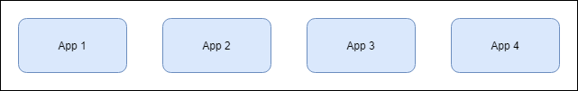

We have "old" code running on all servers.

---

### Servers Down

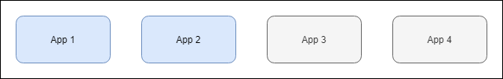

We still have "old" code running on servers but some have gone down, leading to a potentially degraded experience.

---

### New Code

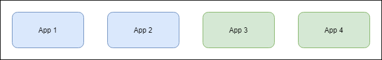

During this phase, we have old and new application code.  We need to support **both** at the same time.

---

### More Servers Down

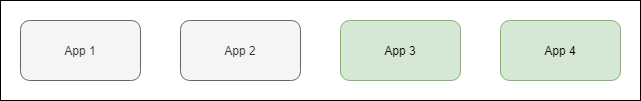

We have only new code but a potentially degraded experience.

---

### All Servers Up

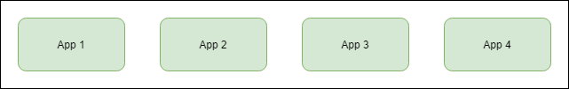

Servers are back to normal, running new code.

---?image=presentation/assets/background/fireworks.jpg&size=cover&opacity=20

### Database Post-Release

During this phase, we get to destroy stuff, removing unused columns, dropping obsolete procedures or tables, deleting old data, etc.

Database post-release can go on as long as needed and customers should not notice a thing.

---

@title[Making Life Simpler]

## Agenda

1. Our Enemy the Downtime
2. The Flow
3. **Making Life Simpler**
4. Stored Procedure Changes
5. Table Changes
6. Index Changes
7. Constraint Changes
8. Identity Changes
9. A Case Study

---?image=presentation/assets/background/engineering.jpg&size=cover&opacity=20

### Key Assumptions

I will make three key assumptions.  These make deployment much easier and help reduce the risk of extended downtime due to a process failure.

1. You have code in source control
2. You have an automated release process
3. You have a continuous integration pipeline

---?image=presentation/assets/background/records.jpg&size=cover&opacity=20

### Source Control

Source control is not mandatory but it is **really** helpful.  Source control is a safety net and allows you to revert code quickly in event of failure.

Git is the most popular source control system, but use whatever you want.

---?image=presentation/assets/background/traffic-light.jpg&size=cover&opacity=20

### Automated Release Process

**That** you have something is more important than the tool itself.  Use Azure DevOps, Octopus Deploy, Jenkins, a hand-built solution, or whatever works.

Automated release processes ensure all scripts go and that each release is consistent.  Humans make a lot of replication mistakes; let computers do that work.

---?image=presentation/assets/background/intersection.jpg&size=cover&opacity=20

### Continuous Integration Pipeline

With an automated release process, keep deploying to lower environments--you want as many tests of your deployment scripts as possible.  That way you won't have any nasty downtime-related surprises going to production, or errors if you need to re-run scripts.

---?image=presentation/assets/background/legend.jpg&size=cover&opacity=20

### Simplification Measures

In addition to the key assumptions, we have a few tools for making life easier.

1. Use Enterprise Edition
2. Use Read Committed Snapshot Isolation
3. Use Stored Procedures
4. Use Database Tests

---?image=presentation/assets/background/skyline.jpg&size=cover&opacity=20

### Use Enterprise Edition

Enterprise Edition allows you to do things you cannot do in Standard Edition, such as rebuilding indexes online and partitioning tables.  These can make deployments easier.

---?image=presentation/assets/background/hardware.jpg&size=cover&opacity=20

### Use RCSI

Read Committed Snapshot Isolation limits the amount of blocking on tables.  If you can turn it on, do so.  This will let you write to tables without blocking readers.  Note that writers can still block writers with RCSI.

RCSI does increase tempdb usage, sometimes considerably.  Keep that in mind if you haven't turned it on yet.

---?image=presentation/assets/background/lab.jpg&size=cover&opacity=20

### Use Stored Procedures

Stored procedures act as an interface between your application code and your database objects.  Stored procedures let us provide a consistent interface, letting us refactor database code and objects without the application knowing or caring.

Stored procedures also let you explicitly see backward compatibility:  you can (usually) know which of ProcedureV4 and ProcedureV3 is newer.

---?image=presentation/assets/background/magnifying-glass.jpg&size=cover&opacity=20

### Use Database Tests

Database tests give you an extra dose of confidence that your refactoring will not break existing code.  This lets you experiment more without additional risk.

tSQLt is the most popular database test library out there, but it could be as simple as a series of NUnit tests which make stored procedure calls.

---

@title[Stored Procedure Changes]

## Agenda

1. Our Enemy the Downtime
2. The Flow
3. Making Life Simpler
4. **Stored Procedure Changes**
5. Table Changes
6. Index Changes
7. Constraint Changes
8. Identity Changes
9. A Case Study

---?image=presentation/assets/background/water-rocks.jpg&size=cover&opacity=20

### Stored Procedure Changes

Scenarios covered:

1. New stored procedure
2. Add new column to procedure
3. Remove column from procedure
4. Change input parameter
5. Change input parameter -- table type
6. Refactoring a procedure

---?image=presentation/assets/background/demo.jpg&size=cover&opacity=20

### Demo Time

---

### Stored Procedure Recap

What follows are the phase and process for each scenario we have covered.  These are here for your reference.

---?image=presentation/assets/background/storm-clouds.jpg&size=cover&opacity=20

New Stored Procedure

@table[table-header table-tsv text-07](presentation/assets/tsv/11_NewStoredProcedure.txt)

---?image=presentation/assets/background/storm-clouds.jpg&size=cover&opacity=20

Add New Column to Procedure

@table[table-header table-tsv text-07](presentation/assets/tsv/12_NewColumn.txt)

---?image=presentation/assets/background/storm-clouds.jpg&size=cover&opacity=20

Remove Column from Procedure

@table[table-header table-tsv text-07](presentation/assets/tsv/13_RemoveColumn.txt)

---?image=presentation/assets/background/storm-clouds.jpg&size=cover&opacity=20

Change Input Parameter

@table[table-header table-tsv text-07](presentation/assets/tsv/14_ChangeInputParameter.txt)

---?image=presentation/assets/background/storm-clouds.jpg&size=cover&opacity=20

Change Input Paramter -- Table Type

@table[table-header table-tsv text-07](presentation/assets/tsv/15_ChangeInputParameter_TableType.txt)

---?image=presentation/assets/background/storm-clouds.jpg&size=cover&opacity=20

Refactoring a Procedure

@table[table-header table-tsv text-07](presentation/assets/tsv/16_RefactorProcedure.txt)

---

@title[Table Changes]

## Agenda

1. Our Enemy the Downtime
2. The Flow
3. Making Life Simpler
4. Stored Procedure Changes
5. **Table Changes**
6. Index Changes
7. Constraint Changes
8. Identity Changes
9. A Case Study

---?image=presentation/assets/background/table-with-chalkboard.jpg&size=cover&opacity=20

### Table Changes

Scenarios covered:

1. Add a nullable column
2. Add a non-nullable column with a default constraint
3. Backfill a new column
4. Remove a column
5. Remove a column with a constraint
6. Extend VARCHAR column
7. Shrink VARCHAR column
8. Rename a table

---?image=presentation/assets/background/demo.jpg&size=cover&opacity=20

### Demo Time

---

### Table Recap

What follows are the phase and process for each scenario we have covered.  These are here for your reference.

---?image=presentation/assets/background/storm-clouds.jpg&size=cover&opacity=20

Add a Nullable Column

@table[table-header table-tsv text-07](presentation/assets/tsv/21_AddNullableColumn.txt)

---?image=presentation/assets/background/storm-clouds.jpg&size=cover&opacity=20

Add a Non-Nullable Column with a Default Constraint

@table[table-header table-tsv text-07](presentation/assets/tsv/22_AddColumnWithConstraint.txt)

---?image=presentation/assets/background/storm-clouds.jpg&size=cover&opacity=20

Backfill a New Column

@table[table-header table-tsv text-05](presentation/assets/tsv/23_BackfillColumn.txt)

---?image=presentation/assets/background/storm-clouds.jpg&size=cover&opacity=20

Remove a Column

@table[table-header table-tsv text-07](presentation/assets/tsv/24_RemoveColumn.txt)

---?image=presentation/assets/background/storm-clouds.jpg&size=cover&opacity=20

Remove a Column with a Constraint

@table[table-header table-tsv text-07](presentation/assets/tsv/25_RemoveColumnWithConstraint.txt)

---?image=presentation/assets/background/storm-clouds.jpg&size=cover&opacity=20

Extend a VARCHAR Column

@table[table-header table-tsv text-07](presentation/assets/tsv/26_ExtendVarcharColumn.txt)

---?image=presentation/assets/background/storm-clouds.jpg&size=cover&opacity=20

Shrink a VARCHAR Column

@table[table-header table-tsv text-05](presentation/assets/tsv/27_ShrinkVarcharColumn.txt)

---?image=presentation/assets/background/storm-clouds.jpg&size=cover&opacity=20

Rename a Table

@table[table-header table-tsv text-07](presentation/assets/tsv/28_RenameTable.txt)

---

@title[Index Changes]

## Agenda

1. Our Enemy the Downtime
2. The Flow
3. Making Life Simpler
4. Stored Procedure Changes
5. Table Changes
6. **Index Changes**
7. Constraint Changes
8. Identity Changes
9. A Case Study

---?image=presentation/assets/background/arrow.jpg&size=cover&opacity=20

### Index Changes

Scenarios covered:

1. Add a non-clustered index
2. Drop a non-clustered index
3. Create a clustered index
4. Change a clustered index which is not the primary key
5. Separate out a combination primary key and clustered index

---?image=presentation/assets/background/demo.jpg&size=cover&opacity=20

### Demo Time

---

### Index Recap

What follows are the phase and process for each scenario we have covered.  These are here for your reference.

---?image=presentation/assets/background/storm-clouds.jpg&size=cover&opacity=20

Add a Non-Clustered Index

@table[table-header table-tsv text-07](presentation/assets/tsv/30_CreateIndex.txt)

---?image=presentation/assets/background/storm-clouds.jpg&size=cover&opacity=20

Drop a Non-Clustered Index

@table[table-header table-tsv text-07](presentation/assets/tsv/31_DropIndex.txt)

---?image=presentation/assets/background/storm-clouds.jpg&size=cover&opacity=20

Add a Clustered Index

@table[table-header table-tsv text-07](presentation/assets/tsv/32_CreateClusteredIndex.txt)

---?image=presentation/assets/background/storm-clouds.jpg&size=cover&opacity=20

Change a Non-Primary Key Clustered Index 

@table[table-header table-tsv text-07](presentation/assets/tsv/33_ChangeNonPKClusteredIndex.txt)

---?image=presentation/assets/background/storm-clouds.jpg&size=cover&opacity=20

Separate Out a Primary Key + Clustered Index

@table[table-header table-tsv text-07](presentation/assets/tsv/34_SeparatePKAndCI.txt)

---

@title[Constraint Changes]

## Agenda

1. Our Enemy the Downtime
2. The Flow
3. Making Life Simpler
4. Stored Procedure Changes
5. Table Changes
6. Index Changes
7. **Constraint Changes**
8. Identity Changes
9. A Case Study

---?image=presentation/assets/background/chain.jpg&size=cover&opacity=20

### Constraint Changes

Scenarios covered:

1. Add a default constraint
2. Change a default constraint
3. Add a unique key constraint
4. Add other constraints

---?image=presentation/assets/background/demo.jpg&size=cover&opacity=20

### Demo Time

---

### Constraints Recap

What follows are the phase and process for each scenario we have covered.  These are here for your reference.

---?image=presentation/assets/background/storm-clouds.jpg&size=cover&opacity=20

Add a Default Constraint

@table[table-header table-tsv text-07](presentation/assets/tsv/41_AddDefaultConstraint.txt)

---?image=presentation/assets/background/storm-clouds.jpg&size=cover&opacity=20

Change a Default Constraint

@table[table-header table-tsv text-07](presentation/assets/tsv/42_ChangeDefaultConstraint.txt)

---?image=presentation/assets/background/storm-clouds.jpg&size=cover&opacity=20

Add a Unique Key Constraint

@table[table-header table-tsv text-07](presentation/assets/tsv/43_AddUniqueKeyConstraint.txt)

---?image=presentation/assets/background/storm-clouds.jpg&size=cover&opacity=20

Add Other Constraints

@table[table-header table-tsv text-05](presentation/assets/tsv/44_AddOtherConstraints.txt)

---

@title[Identity Changes]

## Agenda

1. Our Enemy the Downtime
2. The Flow
3. Making Life Simpler
4. Stored Procedure Changes
5. Table Changes
6. Index Changes
7. Constraint Changes
8. **Identity Changes**
9. A Case Study

---?image=presentation/assets/background/eye.jpg&size=cover&opacity=20

### Identity Changes

Scenarios covered:

1. Add an identity column to an existing table
2. Reseed an identity column
3. Change the data type of an identity column

---?image=presentation/assets/background/demo.jpg&size=cover&opacity=20

### Demo Time

---

### Identity Recap

What follows are the phase and process for each scenario we have covered.  These are here for your reference.

---?image=presentation/assets/background/storm-clouds.jpg&size=cover&opacity=20

Add an Identity Column to an Existing Table

@table[table-header table-tsv text-07](presentation/assets/tsv/51_AddIdentityColumn.txt)

---?image=presentation/assets/background/storm-clouds.jpg&size=cover&opacity=20

Reseed an Identity Column

@table[table-header table-tsv text-07](presentation/assets/tsv/52_ReseedIdentityColumn.txt)

---?image=presentation/assets/background/storm-clouds.jpg&size=cover&opacity=20

Change the Data Type of an Identity Column

@table[table-header table-tsv text-05](presentation/assets/tsv/53_ChangeIdentityColumnType.txt)

---

@title[A Case Study]

## Agenda

1. Our Enemy the Downtime
2. The Flow
3. Making Life Simpler
4. Stored Procedure Changes
5. Table Changes
6. Index Changes
7. Constraint Changes
8. Identity Changes
9. **A Case Study**

---?image=presentation/assets/background/easel.jpg&size=cover&opacity=20

### A Case Study

As a Database Engineer, I was responsible for approximately 200 tables and 800 stored procedures.

Most of these tables had a column called `ClientID` as part of the primary key.  The only problem?  It needs to be called `ProfileID`.  Which means updating 150+ tables and 700+ stored procedures.  Without extended downtime.

---?image=presentation/assets/background/looking-glass.jpg&size=cover&opacity=20

### The Scope

* Rename `ClientID` to `ProfileID` on 150 tables, including constraint and index names.
* Drop 150 unused procedures and 20 unused tables.
* Rename `ClientID` to `ProfileID` on 550+ procedures.  And refactor while we're in there.
* Update SSIS packages to use `ProfileID` instead of `ClientID`.
* Convert ad hoc queries in code to stored procedures and make them use `ProfileID`.

---

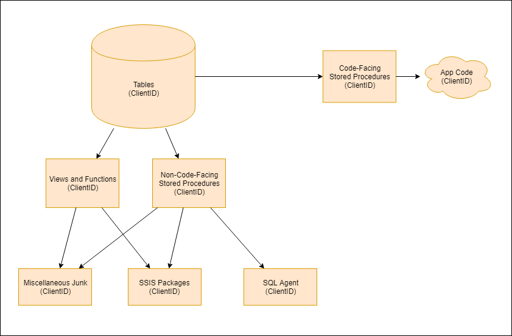

---?image=presentation/assets/background/junk.jpg&size=cover&opacity=20

### Pre-Pre-Release (Phase 1)

* Begin reformatting and refactoring procedures.
* Look for unused procedures.  Search in plan and procedure cache, code base, SQL Agent jobs, SSIS packages, metadata tables, etc.  Eliminate broken objects.
* Create lots and lots of database tests.

---?image=presentation/assets/background/cluster.jpg&size=cover&opacity=20

### Pre-Release Phase

* Add `ProfileID` as nullable INT on each table with `ClientID`.

---?image=presentation/assets/background/nesting-pots.jpg&size=cover&opacity=20

### Database Release (Phase 2a)

* Release temporary procedures which take `@ClientID` and `@ProfileID` as parameters.  
* Scoop out logic from app-level procedures and put into temp procedures.  Run `ISNULL(@ProfileID, @ClientID)` checks on these.
* Turn app-level procedures into shells which call temp procedures.

---

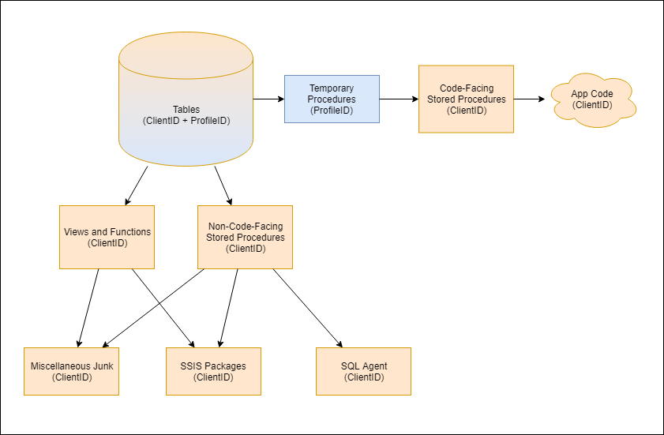

---?image=presentation/assets/background/connections.jpg&size=cover&opacity=20

### Database Release (Phase 2b)

Change references in views and functions to return `ISNULL(ProfileID, ClientID)` instead of `ClientID`.

---

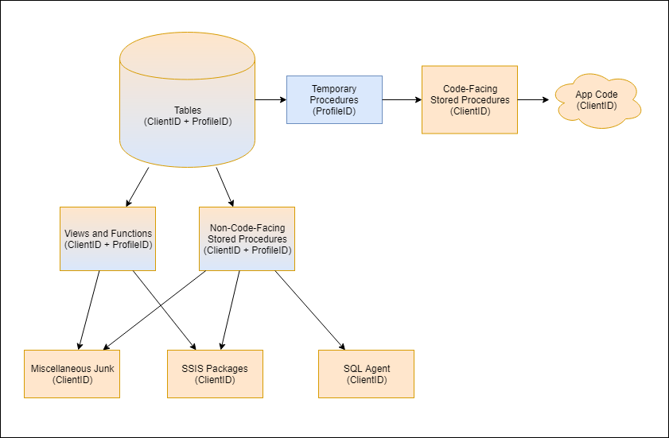

---?image=presentation/assets/background/greenscreen.jpg&size=cover&opacity=20

### Database Release (Phase 2c)

Update non-application SQL code to run `ISNULL(ProfileID, ClientID)` checks.  This includes:

* SQL Agent jobs
* Triggers
* Non-application stored procedures
* SSIS packages
* Other processes

---

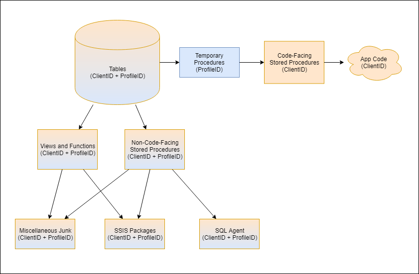

---?image=presentation/assets/background/telephones.jpg&size=cover&opacity=20

### Database Release (Phase 3)

Swap `ProfileID` and `ClientID`:

* Rename `ProfileID` to `ProfileID2`
* Rename `ClientID` to `ProfileID`
* Add new `ClientID` nullable integer
* Drop `ProfileID2`

Then rename all constraints and indexes using `sp_rename`.

---

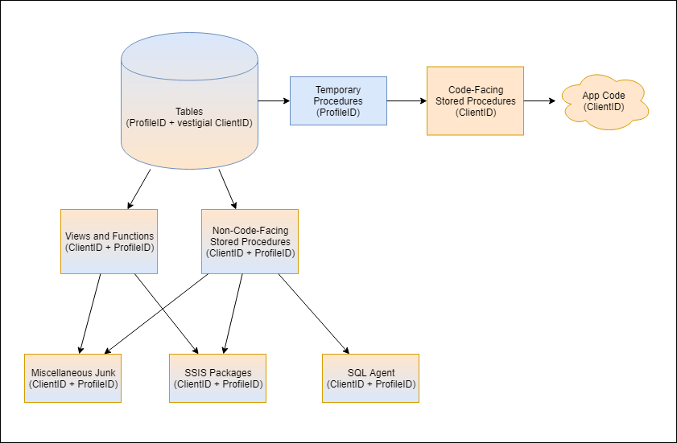

---?image=presentation/assets/background/lego.jpg&size=cover&opacity=20

### Database Post-Release (Phase 4)

Deploy final versions of "temp" application code procedures:  replace `@ClientID` with `@ProfileID` in app procedures and change `ISNULL(ProfileID, ClientID)` to `ProfileID`.

Return `ProfileID` column on procedures as well as `ProfileID AS ClientID`.

---

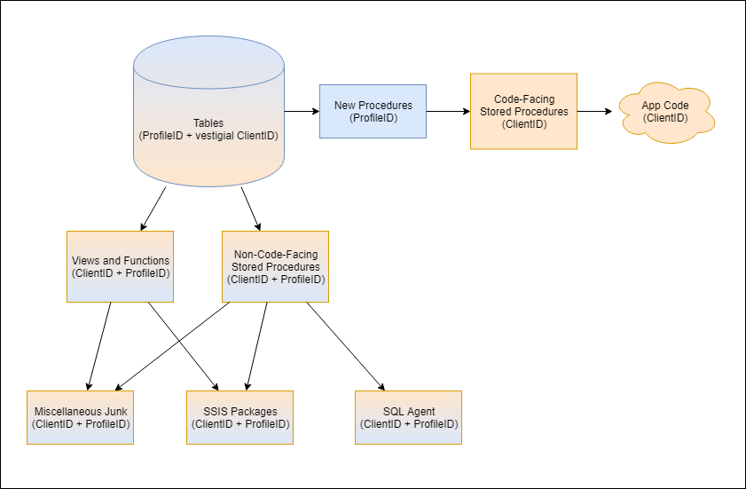

---?image=presentation/assets/background/flexible.jpg&size=cover&opacity=20

### Database Post-Release (Phase 5)

Update non-application SQL code to change `ISNULL(ProfileID, ClientID)` to `ProfileID`.

---

---?image=presentation/assets/background/flow.jpg&size=cover&opacity=20

### Database Post-Release (Phase 6)

Update views and functions to change `ISNULL(ProfileID, ClientID)` checks to `ProfileID`.

Include `ProfileID` and `ProfileID AS ClientID` columns in result sets.

---

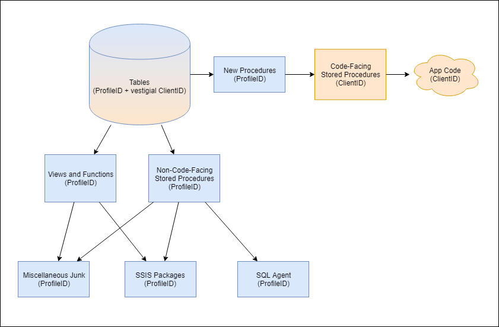

---?image=presentation/assets/background/excavator.jpg&size=cover&opacity=20

### Post- Database Post-Release (Phase 7)

* Drop the empty ClientID column on each table.
* Deprecate obsolete objects.

---

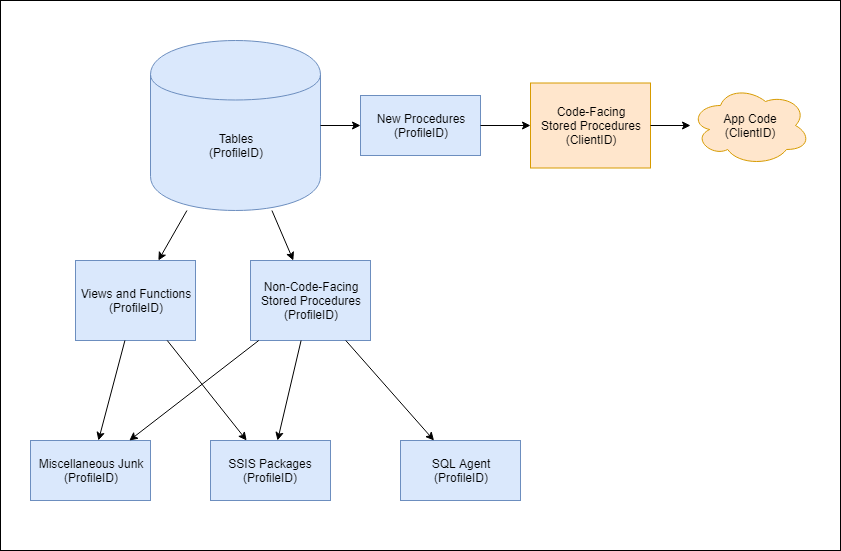

---?image=presentation/assets/background/growth.jpg&size=cover&opacity=20

### Post- Database Post-Release (Phase 8)

Update application code over time to call new procedures instead of old code-facing procedures and change `ClientID` code references to `ProfileID`.  Deprecate old procedures over time.

---

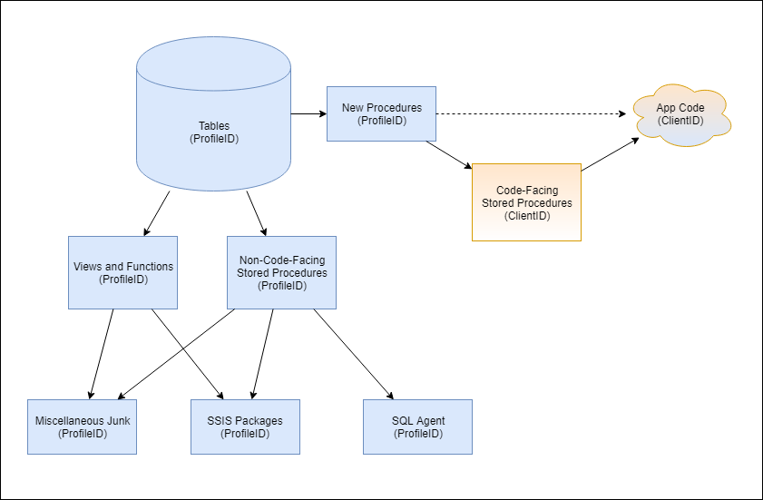

---?image=presentation/assets/background/wrappingup.jpg&size=cover&opacity=20

@title[Wrapping Up]

### Wrapping Up

"Zero" downtime database deployments aren't for every company.  If you have the ability to take downtime windows, your deployments are significantly easier.

Still, if you do need these tools, it is good to know what you can safely do without blocking your customers.

---

### Wrapping Up

To learn more, go here:  <a href="https://csmore.info/on/zdt">https://CSmore.info/on/zdt</a>

And for help, contact me:  <a href="mailto:feasel@catallaxyservices.com">feasel@catallaxyservices.com</a> | <a href="https://www.twitter.com/feaselkl">@feaselkl</a>
